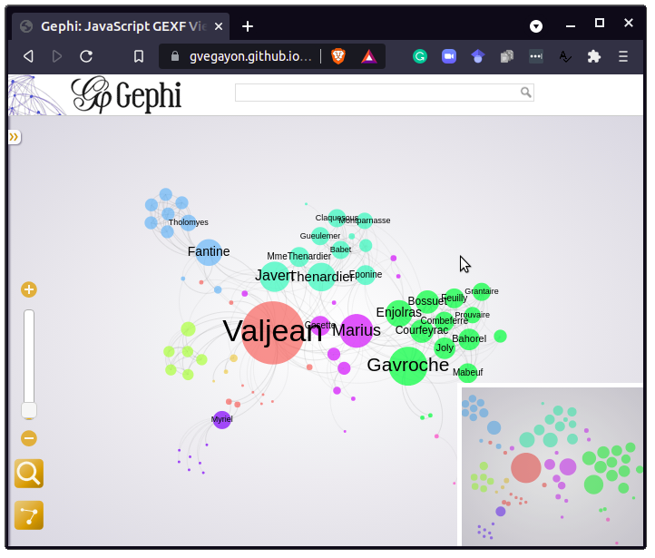

[](https://cran.r-project.org/package=rgexf)
[](https://cran.r-project.org/package=rgexf)
[](https://cran.r-project.org/package=rgexf)
[](https://github.com/gvegayon/rgexf/actions/workflows/ci.yml)
[](https://github.com/gvegayon/rgexf/actions/workflows/website.yml)
[](https://app.codecov.io/github/gvegayon/rgexf?branch=master)
[](https://doi.org/10.21105/joss.03456)
[](https://github.com/sponsors/gvegayon)

# rgexf: Build, Import and Export GEXF Graph Files 

The first R package to work with GEXF graph files (used in Gephi and
others). `rgexf` allows reading and writing graph files, including:

1.  Nodes/edges attributes,

2.  GEXF viz attributes (such as color, size, and position),

3.  Network dynamics (for both edges and nodes, including spells) and

4.  Edges weighting.

Users can build/handle graphs element-by-element or through data-frames,
visualize the graph on a web browser through ~~sigmajs javascript~~
[gexf-js](https://github.com/raphv/gexf-js) library and interact with
the igraph package.

# Changes in rgexf version 0.16.3 (2024-06-27)

- Dynamically loaded components in the Rd files were removed to comply
  with new CRAN policies.

More in the [NEWS.md](NEWS.md) file.

# Installation

To install the latest version of `rgexf`, you can use `devtools`

``` r
library(devtools)
install_github("gvegayon/rgexf")
```

The more stable (but old) version of `rgexf` can be found on CRAN too:

    install.packages("rgexf")

# Citation

``` r
citation(package="rgexf")
```

    To cite rgexf in publications use the following paper:

      Vega Yon G (2021). "Building, Importing, and Exporting GEXF Graph
      Files with rgexf." _Journal of Open Source Software_, *6*, 3456.
      doi:10.21105/joss.03456 <https://doi.org/10.21105/joss.03456>,
      <https://doi.org/10.21105/joss.03456>.

    And the actual R package:

      Vega Yon G, Fábrega Lacoa J, Kunst J (????). _netdiffuseR: Build,
      Import and Export GEXF Graph Files_. doi:10.5281/zenodo.5182708
      <https://doi.org/10.5281/zenodo.5182708>, R package version 0.16.3,
      <https://github.com/gvegayon/rgexf>.

    To see these entries in BibTeX format, use 'print(<citation>,
    bibtex=TRUE)', 'toBibtex(.)', or set
    'options(citation.bibtex.max=999)'.

# Examples

## Example 1: Importing GEXF files

We can use the `read.gexf` function to read GEXF files into R:

``` r
# Loading the package
library(rgexf)

g <- system.file("gexf-graphs/lesmiserables.gexf", package="rgexf")
g <- read.gexf(g)
head(g) # Taking a look at the first handful
```

    <?xml version="1.0" encoding="UTF-8"?>
    <gexf xmlns="http://www.gexf.net/1.3" xmlns:viz="http://www.gexf.net/1.3/viz" xmlns:xsi="http://www.w3.org/2001/XMLSchema-instance" version="1.3" xsi:schemaLocation="http://www.gexf.net/1.3 http://www.gexf.net/1.3/gexf.xsd">
      <meta lastmodifieddate="2016-11-09">
        <creator>Gephi 0.9</creator>
        <description/>
      </meta>
      <graph defaultedgetype="undirected" mode="static">
        <attributes class="node" mode="static">
          <attribute id="modularity_class" title="Modularity Class" type="integer"/>
        </attributes>
        <nodes>
          <node id="11" label="Valjean">
            <attvalues>
              <attvalue for="modularity_class" value="1"/>
            </attvalues>
            <viz:size value="100.0"/>
            <viz:position x="-87.93029" y="6.8120565"/>
            <viz:color r="245" g="91" b="91"/>
          </node>
          <node id="48" label="Gavroche">
            <attvalues>
              <attvalue for="modularity_class" value="8"/>
            </attvalues>
            <viz:size value="61.600006"/>
            <viz:position x="387.89572" y="-110.462326"/>
            <viz:color r="91" g="245" b="91"/>
          </node>
          <node id="55" label="Marius">
            <attvalues>
              <attvalue for="modularity_class" value="6"/>
            </attvalues>
            <viz:size value="53.37143"/>
            <viz:position x="206.44687" y="13.805411"/>
            <viz:color r="194" g="91" b="245"/>
          </node>
          <node id="27" label="Javert">
            <attvalues>
              <attvalue for="modularity_class" value="7"/>
            </attvalues>
            <viz:size value="47.88571"/>
            <viz:position x="-81.46074" y="204.20204"/>
            <viz:color r="91" g="245" b="194"/>
          </node>
          <node id="25" label="Thenardier">
            <attvalues>
              <attvalue for="modularity_class" value="7"/>
            </attvalues>
            <viz:size value="45.142853"/>
            <viz:position x="82.80825" y="203.1144"/>
            <viz:color r="91" g="245" b="194"/>
          </node>
          <node id="23" label="Fantine">
            <attvalues>
              <attvalue for="modularity_class" value="2"/>
            </attvalues>
            <viz:size value="42.4"/>
            <viz:position x="-313.42786" y="289.44803"/>
            <viz:color r="91" g="194" b="245"/>
          </node>
                ...
         </nodes>
        <edges>
          <edge id="0" source="1" target="0"/>
          <edge id="1" source="2" target="0" weight="8.0"/>
          <edge id="2" source="3" target="0" weight="10.0"/>
          <edge id="3" source="3" target="2" weight="6.0"/>
          <edge id="4" source="4" target="0"/>
          <edge id="5" source="5" target="0"/>
                ...
         </edges>
      </graph>
    </gexf>

Moreover, we can use the `gexf.to.igraph()` function to convert the
`gexf` object into an `igraph` object:

``` r
library(igraph)
```


    Attaching package: 'igraph'

    The following objects are masked from 'package:stats':

        decompose, spectrum

    The following object is masked from 'package:base':

        union

``` r
ig <- gexf.to.igraph(g)

op <- par(mai = rep(0, 4)) # Making room
plot(ig)
```


``` r
par(op)
```

Using the `plot.gexf` method–which uses the `gexf-js` JavaScript
library–results in a Web visualization of the graph, like this:

``` r
plot(g)
```



A live version of the figure is available
[here](https://gvegayon.github.io/rgexf/lesmiserables/).

## Example 2: Static net

``` r
# Creating a group of individuals and their relations
people <- data.frame(matrix(c(1:4, 'juan', 'pedro', 'matthew', 'carlos'),ncol=2))
people
```

      X1      X2
    1  1    juan
    2  2   pedro
    3  3 matthew
    4  4  carlos

``` r
# Defining the relations structure
relations <- data.frame(matrix(c(1,4,1,2,1,3,2,3,3,4,4,2), ncol=2, byrow=T))
relations
```

      X1 X2
    1  1  4
    2  1  2
    3  1  3
    4  2  3
    5  3  4
    6  4  2

``` r
# Getting things done
write.gexf(people, relations)
```

    <?xml version="1.0" encoding="UTF-8"?>
    <gexf xmlns="http://www.gexf.net/1.3" xmlns:viz="http://www.gexf.net/1.3/viz" xmlns:xsi="http://www.w3.org/2001/XMLSchema-instance" xsi:schemaLocation="http://www.gexf.net/1.3 http://www.gexf.net/1.3/gexf.xsd" version="1.3">
      <meta lastmodifieddate="2024-10-18">
        <creator>NodosChile</creator>
        <description>A GEXF file written in R with "rgexf"</description>
        <keywords>GEXF, NodosChile, R, rgexf, Gephi</keywords>
      </meta>
      <graph mode="static" defaultedgetype="undirected">
        <nodes>
          <node id="1" label="juan">
            <viz:color r="255" g="99" b="71" a="1"/>
            <viz:position x="250" y="250" z="0"/>
            <viz:size value="125"/>
          </node>
          <node id="2" label="pedro">
            <viz:color r="255" g="99" b="71" a="1"/>
            <viz:position x="-186.698836260964" y="-250" z="0"/>
            <viz:size value="125"/>
          </node>
          <node id="3" label="matthew">
            <viz:color r="255" g="99" b="71" a="1"/>
            <viz:position x="58.6345969641703" y="21.0570796040237" z="0"/>
            <viz:size value="125"/>
          </node>
          <node id="4" label="carlos">
            <viz:color r="255" g="99" b="71" a="1"/>
            <viz:position x="-250" y="52.1739476510533" z="0"/>
            <viz:size value="125"/>
          </node>
        </nodes>
        <edges>
          <edge id="0" source="1" target="4" weight="1"/>
          <edge id="1" source="1" target="2" weight="1"/>
          <edge id="2" source="1" target="3" weight="1"/>
          <edge id="3" source="2" target="3" weight="1"/>
          <edge id="4" source="3" target="4" weight="1"/>
          <edge id="5" source="4" target="2" weight="1"/>
        </edges>
      </graph>
    </gexf>
     

## Example 3: Dynamic net

``` r
# Defining the dynamic structure, note that there are some nodes that have NA at the end.
time<-matrix(c(10.0,13.0,2.0,2.0,12.0,rep(NA,3)), nrow=4, ncol=2)
time
```

         [,1] [,2]
    [1,]   10   12
    [2,]   13   NA
    [3,]    2   NA
    [4,]    2   NA

``` r
# Getting things done
write.gexf(people, relations, nodeDynamic=time)
```

    <?xml version="1.0" encoding="UTF-8"?>
    <gexf xmlns="http://www.gexf.net/1.3" xmlns:viz="http://www.gexf.net/1.3/viz" xmlns:xsi="http://www.w3.org/2001/XMLSchema-instance" xsi:schemaLocation="http://www.gexf.net/1.3 http://www.gexf.net/1.3/gexf.xsd" version="1.3">
      <meta lastmodifieddate="2024-10-18">
        <creator>NodosChile</creator>
        <description>A GEXF file written in R with "rgexf"</description>
        <keywords>GEXF, NodosChile, R, rgexf, Gephi</keywords>
      </meta>
      <graph mode="dynamic" start="2" end="13" timeformat="double" defaultedgetype="undirected">
        <nodes>
          <node id="1" label="juan" start="10" end="12">
            <viz:color r="255" g="99" b="71" a="1"/>
            <viz:position x="170.83225378951" y="250" z="0"/>
            <viz:size value="125"/>
          </node>
          <node id="2" label="pedro" start="13" end="13">
            <viz:color r="255" g="99" b="71" a="1"/>
            <viz:position x="-185.575718708292" y="99.4676000305198" z="0"/>
            <viz:size value="125"/>
          </node>
          <node id="3" label="matthew" start="2" end="13">
            <viz:color r="255" g="99" b="71" a="1"/>
            <viz:position x="-250" y="-250" z="0"/>
            <viz:size value="125"/>
          </node>
          <node id="4" label="carlos" start="2" end="13">
            <viz:color r="255" g="99" b="71" a="1"/>
            <viz:position x="250" y="223.447267948248" z="0"/>
            <viz:size value="125"/>
          </node>
        </nodes>
        <edges>
          <edge id="0" source="1" target="4" weight="1"/>
          <edge id="1" source="1" target="2" weight="1"/>
          <edge id="2" source="1" target="3" weight="1"/>
          <edge id="3" source="2" target="3" weight="1"/>
          <edge id="4" source="3" target="4" weight="1"/>
          <edge id="5" source="4" target="2" weight="1"/>
        </edges>
      </graph>
    </gexf>
     

## Example 4: More complex… Dynamic graph with attributes both for nodes and edges

First, we define dynamics

``` r
time.nodes<-matrix(c(10.0,13.0,2.0,2.0,12.0,rep(NA,3)), nrow=4, ncol=2)
time.nodes
```

         [,1] [,2]
    [1,]   10   12
    [2,]   13   NA
    [3,]    2   NA
    [4,]    2   NA

``` r
time.edges<-matrix(c(10.0,13.0,2.0,2.0,12.0,1,5,rep(NA,5)), nrow=6, ncol=2)
time.edges
```

         [,1] [,2]
    [1,]   10    5
    [2,]   13   NA
    [3,]    2   NA
    [4,]    2   NA
    [5,]   12   NA
    [6,]    1   NA

Now we define the attribute values

``` r
# Defining a data frame of attributes for nodes and edges
node.att <- data.frame(letrafavorita=letters[1:4], numbers=1:4, stringsAsFactors=F)
node.att
```

      letrafavorita numbers
    1             a       1
    2             b       2
    3             c       3
    4             d       4

``` r
edge.att <- data.frame(letrafavorita=letters[1:6], numbers=1:6, stringsAsFactors=F)
edge.att
```

      letrafavorita numbers
    1             a       1
    2             b       2
    3             c       3
    4             d       4
    5             e       5
    6             f       6

``` r
# Getting the things done
write.gexf(nodes=people, edges=relations, edgeDynamic=time.edges,
           edgesAtt=edge.att, nodeDynamic=time.nodes, nodesAtt=node.att)
```

    <?xml version="1.0" encoding="UTF-8"?>
    <gexf xmlns="http://www.gexf.net/1.3" xmlns:viz="http://www.gexf.net/1.3/viz" xmlns:xsi="http://www.w3.org/2001/XMLSchema-instance" xsi:schemaLocation="http://www.gexf.net/1.3 http://www.gexf.net/1.3/gexf.xsd" version="1.3">
      <meta lastmodifieddate="2024-10-18">
        <creator>NodosChile</creator>
        <description>A GEXF file written in R with "rgexf"</description>
        <keywords>GEXF, NodosChile, R, rgexf, Gephi</keywords>
      </meta>
      <graph mode="dynamic" start="1" end="13" timeformat="double" defaultedgetype="undirected">
        <attributes class="node" mode="static">
          <attribute id="att1" title="letrafavorita" type="string"/>
          <attribute id="att2" title="numbers" type="integer"/>
        </attributes>
        <attributes class="edge" mode="static">
          <attribute id="att1" title="letrafavorita" type="string"/>
          <attribute id="att2" title="numbers" type="integer"/>
        </attributes>
        <nodes>
          <node id="1" label="juan" start="10" end="12">
            <attvalues>
              <attvalue for="att1" value="a"/>
              <attvalue for="att2" value="1"/>
            </attvalues>
            <viz:color r="255" g="99" b="71" a="1"/>
            <viz:position x="54.5768870712791" y="-82.6024016050223" z="0"/>
            <viz:size value="125"/>
          </node>
          <node id="2" label="pedro" start="13" end="13">
            <attvalues>
              <attvalue for="att1" value="b"/>
              <attvalue for="att2" value="2"/>
            </attvalues>
            <viz:color r="255" g="99" b="71" a="1"/>
            <viz:position x="68.6545049832694" y="-19.5303942478532" z="0"/>
            <viz:size value="125"/>
          </node>
          <node id="3" label="matthew" start="2" end="13">
            <attvalues>
              <attvalue for="att1" value="c"/>
              <attvalue for="att2" value="3"/>
            </attvalues>
            <viz:color r="255" g="99" b="71" a="1"/>
            <viz:position x="250" y="250" z="0"/>
            <viz:size value="125"/>
          </node>
          <node id="4" label="carlos" start="2" end="13">
            <attvalues>
              <attvalue for="att1" value="d"/>
              <attvalue for="att2" value="4"/>
            </attvalues>
            <viz:color r="255" g="99" b="71" a="1"/>
            <viz:position x="-250" y="-250" z="0"/>
            <viz:size value="125"/>
          </node>
        </nodes>
        <edges>
          <edge id="0" source="1" target="4" start="10" end="5" weight="1">
            <attvalues>
              <attvalue for="att1" value="a"/>
              <attvalue for="att2" value="1"/>
            </attvalues>
          </edge>
          <edge id="1" source="1" target="2" start="13" end="13" weight="1">
            <attvalues>
              <attvalue for="att1" value="b"/>
              <attvalue for="att2" value="2"/>
            </attvalues>
          </edge>
          <edge id="2" source="1" target="3" start="2" end="13" weight="1">
            <attvalues>
              <attvalue for="att1" value="c"/>
              <attvalue for="att2" value="3"/>
            </attvalues>
          </edge>
          <edge id="3" source="2" target="3" start="2" end="13" weight="1">
            <attvalues>
              <attvalue for="att1" value="d"/>
              <attvalue for="att2" value="4"/>
            </attvalues>
          </edge>
          <edge id="4" source="3" target="4" start="12" end="13" weight="1">
            <attvalues>
              <attvalue for="att1" value="e"/>
              <attvalue for="att2" value="5"/>
            </attvalues>
          </edge>
          <edge id="5" source="4" target="2" start="1" end="13" weight="1">
            <attvalues>
              <attvalue for="att1" value="f"/>
              <attvalue for="att2" value="6"/>
            </attvalues>
          </edge>
        </edges>
      </graph>
    </gexf>
     

# Code of Conduct

We welcome contributions to `rgexf`. Whether reporting a bug, starting a
discussion by asking a question, or proposing/requesting a new feature,
please go by creating a new issue
[here](https://github.com/gvegayon/rgexf/issues) so that we can talk
about it.

Please note that the rgexf project is released with a [Contributor Code
of
Conduct](https://contributor-covenant.org/version/2/0/CODE_OF_CONDUCT.html).
By contributing to this project, you agree to abide by its terms

# Session info

``` r
devtools::session_info()
```

    ─ Session info ───────────────────────────────────────────────────────────────
     setting  value
     version  R version 4.4.1 (2024-06-14)
     os       macOS 15.0.1
     system   aarch64, darwin23.4.0
     ui       unknown
     language (EN)
     collate  en_US.UTF-8
     ctype    en_US.UTF-8
     tz       America/Denver
     date     2024-10-18
     pandoc   3.2.1 @ /opt/homebrew/bin/ (via rmarkdown)

    ─ Packages ───────────────────────────────────────────────────────────────────
     package     * version   date (UTC) lib source
     cachem        1.1.0     2024-05-16 [1] CRAN (R 4.4.1)
     cli           3.6.3     2024-06-21 [1] CRAN (R 4.4.1)
     devtools      2.4.5     2022-10-11 [1] CRAN (R 4.4.1)
     digest        0.6.37    2024-08-19 [1] RSPM (R 4.4.1)
     ellipsis      0.3.2     2021-04-29 [1] CRAN (R 4.4.1)
     evaluate      1.0.0     2024-09-17 [1] RSPM (R 4.4.1)
     fastmap       1.2.0     2024-05-15 [1] CRAN (R 4.4.1)
     fs            1.6.4     2024-04-25 [1] CRAN (R 4.4.1)
     glue          1.7.0     2024-01-09 [1] CRAN (R 4.4.1)
     htmltools     0.5.8.1   2024-04-04 [1] CRAN (R 4.4.1)
     htmlwidgets   1.6.4     2023-12-06 [1] CRAN (R 4.4.1)
     httpuv        1.6.15    2024-03-26 [1] CRAN (R 4.4.1)
     igraph      * 2.0.3     2024-03-13 [1] RSPM (R 4.4.1)
     jsonlite      1.8.9     2024-09-20 [1] RSPM (R 4.4.1)
     knitr         1.47      2024-05-29 [1] CRAN (R 4.4.1)
     later         1.3.2     2023-12-06 [1] CRAN (R 4.4.1)
     lifecycle     1.0.4     2023-11-07 [1] CRAN (R 4.4.1)
     magrittr      2.0.3     2022-03-30 [1] CRAN (R 4.4.1)
     memoise       2.0.1     2021-11-26 [1] CRAN (R 4.4.1)
     mime          0.12      2021-09-28 [1] CRAN (R 4.4.1)
     miniUI        0.1.1.1   2018-05-18 [1] CRAN (R 4.4.1)
     pkgbuild      1.4.4     2024-03-17 [1] CRAN (R 4.4.1)
     pkgconfig     2.0.3     2019-09-22 [1] CRAN (R 4.4.1)
     pkgload       1.4.0     2024-06-28 [1] CRAN (R 4.4.1)
     profvis       0.3.8     2023-05-02 [1] CRAN (R 4.4.1)
     promises      1.3.0     2024-04-05 [1] CRAN (R 4.4.1)
     purrr         1.0.2     2023-08-10 [1] CRAN (R 4.4.1)
     R6            2.5.1     2021-08-19 [1] CRAN (R 4.4.1)
     Rcpp          1.0.13    2024-07-17 [1] RSPM (R 4.4.1)
     remotes       2.5.0     2024-03-17 [1] CRAN (R 4.4.1)
     rgexf       * 0.16.3    2024-10-18 [1] local
     rlang         1.1.4     2024-06-04 [1] CRAN (R 4.4.1)
     rmarkdown     2.27      2024-05-17 [1] CRAN (R 4.4.1)
     servr         0.30      2024-03-23 [1] CRAN (R 4.4.1)
     sessioninfo   1.2.2     2021-12-06 [1] CRAN (R 4.4.1)
     shiny         1.8.1.1   2024-04-02 [1] CRAN (R 4.4.1)
     stringi       1.8.4     2024-05-06 [1] CRAN (R 4.4.1)
     stringr       1.5.1     2023-11-14 [1] CRAN (R 4.4.1)
     urlchecker    1.0.1     2021-11-30 [1] CRAN (R 4.4.1)
     usethis       2.2.3     2024-02-19 [1] CRAN (R 4.4.1)
     vctrs         0.6.5     2023-12-01 [1] CRAN (R 4.4.1)
     xfun          0.45      2024-06-16 [1] CRAN (R 4.4.1)
     XML           3.99-0.17 2024-06-25 [1] CRAN (R 4.4.1)
     xtable        1.8-4     2019-04-21 [1] CRAN (R 4.4.1)
     yaml          2.3.8     2023-12-11 [1] CRAN (R 4.4.1)

     [1] /opt/homebrew/lib/R/4.4/site-library
     [2] /opt/homebrew/Cellar/r/4.4.1/lib/R/library

    ──────────────────────────────────────────────────────────────────────────────
