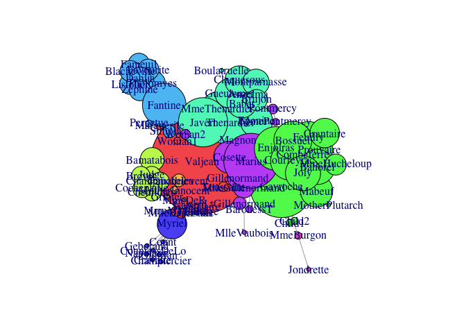

[](https://cran.r-project.org/package=rgexf)
[](https://cran.r-project.org/package=rgexf)
[](https://cran.r-project.org/package=rgexf)
[](https://github.com/gvegayon/rgexf/actions/workflows/ci.yml)
[](https://github.com/gvegayon/rgexf/actions/workflows/website.yml)
[](https://ci.appveyor.com/project/gvegayon/rgexf)
[](https://codecov.io/github/gvegayon/rgexf?branch=master)
[](https://doi.org/10.21105/joss.03456)

# rgexf: Build, Import and Export GEXF Graph Files 

The first R package to work with GEXF graph files (used in Gephi and
others). `rgexf` allows the user to quickly build/read graph files,
including:

1.  Nodes/edges attributes,

2.  GEXF viz attributes (such as color, size, and position),

3.  Network dynamics (for both edges and nodes, including spells), and

4.  Edges weighting.

Users can build/handle graphs element-by-element or through data-frames,
visualize the graph on a web browser through ~~sigmajs javascript~~
[gexf-js](https://github.com/raphv/gexf-js) library and interact with
the igraph package.

# Changes in rgexf version 0.16.2 (2021-08-10)

## New features and changes

-   We now have a hex sticker!

-   Users can now cite properly `rgexf` with
    [JOSS](https://joss.theoj.org/papers/10.21105/joss.03456) (see
    `citation(package="rgexf")`).

-   Added a few extra breaks across the examples (suggested by
    <a href="https://github.com/corneliusfritz">@corneliusfritz</a>).

-   Improved documentation regarding spells and dynamic graphs
    (suggested by
    <a href="https://github.com/jonjoncardoso">@jonjoncardoso</a>).

-   New `head()` function allows a glimpse of the `n` first nodes/edges.

## Bug fixes

-   Passing colors with four values (alpha) no longer fails during
    checks. (reported by
    <a href="https://github.com/IsabelFE">@IsabelFE</a>).

-   The summary function prints nodes’ attributes as expected.

-   Hex colors now work (\#41 reported by
    <a href="https://github.com/milnus">@milnus</a>).

-   `gexf.to.igraph` correctly processes edge attributes (\#38 reported
    by <a href="https://github.com/balachia">@balachia</a>).

-   Time range is now correctly computed (\#19).

-   Non-integer ids were incorrectly processed when reading GEXF files.

More in the [NEWS.md](NEWS.md) file.

# Installation

To install the latest version of `rgexf` you can use `devtools`

``` r
library(devtools)
install_github("gvegayon/rgexf")
```

The more stable (but old) version of `rgexf` can be found on CRAN too:

    install.packages("rgexf")

# Citation

``` r
citation(package="rgexf")
```


    To cite rgexf in publications use the following paper:

      Vega Yon, G. G., (2021). Building, Importing, and Exporting GEXF
      Graph Files with rgexf. Journal of Open Source Software, 6(64), 3456,
      https://doi.org/10.21105/joss.03456

    And the actual R package:

    Vega Yon G, Fábrega Lacoa J, Kunst J (2021). _netdiffuseR: Build,
    Import and Export GEXF Graph Files_. doi: 10.5281/zenodo.5182708 (URL:
    https://doi.org/10.5281/zenodo.5182708), R package version 0.16.2,
    <URL: https://github.com/gvegayon/rgexf>.

    To see these entries in BibTeX format, use 'print(<citation>,
    bibtex=TRUE)', 'toBibtex(.)', or set
    'options(citation.bibtex.max=999)'.

# Examples

## Example 1: Importing GEXF files

We can use the `read.gexf` function to read GEXF files into R:

``` r
# Loading the package
library(rgexf)

g <- system.file("gexf-graphs/lesmiserables.gexf", package="rgexf")
g <- read.gexf(g)
head(g) # Taking a look at the first handful
```

    ## <?xml version="1.0" encoding="UTF-8"?>
    ## <gexf xmlns="http://www.gexf.net/1.3" xmlns:viz="http://www.gexf.net/1.3/viz" xmlns:xsi="http://www.w3.org/2001/XMLSchema-instance" version="1.3" xsi:schemaLocation="http://www.gexf.net/1.3 http://www.gexf.net/1.3/gexf.xsd">
    ##   <meta lastmodifieddate="2016-11-09">
    ##     <creator>Gephi 0.9</creator>
    ##     <description/>
    ##   </meta>
    ##   <graph defaultedgetype="undirected" mode="static">
    ##     <attributes class="node" mode="static">
    ##       <attribute id="modularity_class" title="Modularity Class" type="integer"/>
    ##     </attributes>
    ##     <nodes>
    ##       <node id="11" label="Valjean">
    ##         <attvalues>
    ##           <attvalue for="modularity_class" value="1"/>
    ##         </attvalues>
    ##         <viz:size value="100.0"/>
    ##         <viz:position x="-87.93029" y="6.8120565"/>
    ##         <viz:color r="245" g="91" b="91"/>
    ##       </node>
    ##       <node id="48" label="Gavroche">
    ##         <attvalues>
    ##           <attvalue for="modularity_class" value="8"/>
    ##         </attvalues>
    ##         <viz:size value="61.600006"/>
    ##         <viz:position x="387.89572" y="-110.462326"/>
    ##         <viz:color r="91" g="245" b="91"/>
    ##       </node>
    ##       <node id="55" label="Marius">
    ##         <attvalues>
    ##           <attvalue for="modularity_class" value="6"/>
    ##         </attvalues>
    ##         <viz:size value="53.37143"/>
    ##         <viz:position x="206.44687" y="13.805411"/>
    ##         <viz:color r="194" g="91" b="245"/>
    ##       </node>
    ##       <node id="27" label="Javert">
    ##         <attvalues>
    ##           <attvalue for="modularity_class" value="7"/>
    ##         </attvalues>
    ##         <viz:size value="47.88571"/>
    ##         <viz:position x="-81.46074" y="204.20204"/>
    ##         <viz:color r="91" g="245" b="194"/>
    ##       </node>
    ##       <node id="25" label="Thenardier">
    ##         <attvalues>
    ##           <attvalue for="modularity_class" value="7"/>
    ##         </attvalues>
    ##         <viz:size value="45.142853"/>
    ##         <viz:position x="82.80825" y="203.1144"/>
    ##         <viz:color r="91" g="245" b="194"/>
    ##       </node>
    ##       <node id="23" label="Fantine">
    ##         <attvalues>
    ##           <attvalue for="modularity_class" value="2"/>
    ##         </attvalues>
    ##         <viz:size value="42.4"/>
    ##         <viz:position x="-313.42786" y="289.44803"/>
    ##         <viz:color r="91" g="194" b="245"/>
    ##       </node>
    ##          ...
    ##      </nodes>
    ##     <edges>
    ##       <edge id="0" source="1" target="0"/>
    ##       <edge id="1" source="2" target="0" weight="8.0"/>
    ##       <edge id="2" source="3" target="0" weight="10.0"/>
    ##       <edge id="3" source="3" target="2" weight="6.0"/>
    ##       <edge id="4" source="4" target="0"/>
    ##       <edge id="5" source="5" target="0"/>
    ##          ...
    ##      </edges>
    ##   </graph>
    ## </gexf>

Moreover, we can use the `gexf.to.igraph()` function to convert the
`gexf` object into an `igraph` object:

``` r
library(igraph)
```

    ## 
    ## Attaching package: 'igraph'

    ## The following objects are masked from 'package:stats':
    ## 
    ##     decompose, spectrum

    ## The following object is masked from 'package:base':
    ## 
    ##     union

``` r
ig <- gexf.to.igraph(g)

op <- par(mai = rep(0, 4)) # Making room
plot(ig)
```

<!-- -->

``` r
par(op)
```

Using the `plot.gexf` method–which uses the `gexf-js` JavaScript
library–results in a Web visualization of the graph, like this:

``` r
plot(g)
```


An live version of the figure is available
[here](https://gvegayon.github.io/rgexf/lesmiserables/).

## Example 2: Static net

``` r
# Creating a group of individuals and their relations
people <- data.frame(matrix(c(1:4, 'juan', 'pedro', 'matthew', 'carlos'),ncol=2))
people
```

    ##   X1      X2
    ## 1  1    juan
    ## 2  2   pedro
    ## 3  3 matthew
    ## 4  4  carlos

``` r
# Defining the relations structure
relations <- data.frame(matrix(c(1,4,1,2,1,3,2,3,3,4,4,2), ncol=2, byrow=T))
relations
```

    ##   X1 X2
    ## 1  1  4
    ## 2  1  2
    ## 3  1  3
    ## 4  2  3
    ## 5  3  4
    ## 6  4  2

``` r
# Getting things done
write.gexf(people, relations)
```

    ## <?xml version="1.0" encoding="UTF-8"?>
    ## <gexf xmlns="http://www.gexf.net/1.3" xmlns:viz="http://www.gexf.net/1.3/viz" xmlns:xsi="http://www.w3.org/2001/XMLSchema-instance" xsi:schemaLocation="http://www.gexf.net/1.3 http://www.gexf.net/1.3/gexf.xsd" version="1.3">
    ##   <meta lastmodifieddate="2021-08-12">
    ##     <creator>NodosChile</creator>
    ##     <description>A GEXF file written in R with "rgexf"</description>
    ##     <keywords>GEXF, NodosChile, R, rgexf, Gephi</keywords>
    ##   </meta>
    ##   <graph mode="static" defaultedgetype="undirected">
    ##     <nodes>
    ##       <node id="1" label="juan">
    ##         <viz:color r="255" g="99" b="71" a="1"/>
    ##         <viz:position x="100" y="76.2515713120152" z="0"/>
    ##         <viz:size value="10"/>
    ##       </node>
    ##       <node id="2" label="pedro">
    ##         <viz:color r="255" g="99" b="71" a="1"/>
    ##         <viz:position x="-100" y="-100" z="0"/>
    ##         <viz:size value="10"/>
    ##       </node>
    ##       <node id="3" label="matthew">
    ##         <viz:color r="255" g="99" b="71" a="1"/>
    ##         <viz:position x="-33.934012157033" y="55.4559262362359" z="0"/>
    ##         <viz:size value="10"/>
    ##       </node>
    ##       <node id="4" label="carlos">
    ##         <viz:color r="255" g="99" b="71" a="1"/>
    ##         <viz:position x="4.50330959513599" y="100" z="0"/>
    ##         <viz:size value="10"/>
    ##       </node>
    ##     </nodes>
    ##     <edges>
    ##       <edge id="0" source="1" target="4" weight="1"/>
    ##       <edge id="1" source="1" target="2" weight="1"/>
    ##       <edge id="2" source="1" target="3" weight="1"/>
    ##       <edge id="3" source="2" target="3" weight="1"/>
    ##       <edge id="4" source="3" target="4" weight="1"/>
    ##       <edge id="5" source="4" target="2" weight="1"/>
    ##     </edges>
    ##   </graph>
    ## </gexf>
    ## 

## Example 3: Dynamic net

``` r
# Defining the dynamic structure, note that there are some nodes that have NA at the end.
time<-matrix(c(10.0,13.0,2.0,2.0,12.0,rep(NA,3)), nrow=4, ncol=2)
time
```

    ##      [,1] [,2]
    ## [1,]   10   12
    ## [2,]   13   NA
    ## [3,]    2   NA
    ## [4,]    2   NA

``` r
# Getting things done
write.gexf(people, relations, nodeDynamic=time)
```

    ## <?xml version="1.0" encoding="UTF-8"?>
    ## <gexf xmlns="http://www.gexf.net/1.3" xmlns:viz="http://www.gexf.net/1.3/viz" xmlns:xsi="http://www.w3.org/2001/XMLSchema-instance" xsi:schemaLocation="http://www.gexf.net/1.3 http://www.gexf.net/1.3/gexf.xsd" version="1.3">
    ##   <meta lastmodifieddate="2021-08-12">
    ##     <creator>NodosChile</creator>
    ##     <description>A GEXF file written in R with "rgexf"</description>
    ##     <keywords>GEXF, NodosChile, R, rgexf, Gephi</keywords>
    ##   </meta>
    ##   <graph mode="dynamic" start="2" end="13" timeformat="double" defaultedgetype="undirected">
    ##     <nodes>
    ##       <node id="1" label="juan" start="10" end="12">
    ##         <viz:color r="255" g="99" b="71" a="1"/>
    ##         <viz:position x="93.5382155239999" y="100" z="0"/>
    ##         <viz:size value="10"/>
    ##       </node>
    ##       <node id="2" label="pedro" start="13" end="13">
    ##         <viz:color r="255" g="99" b="71" a="1"/>
    ##         <viz:position x="-100" y="-45.2089025903595" z="0"/>
    ##         <viz:size value="10"/>
    ##       </node>
    ##       <node id="3" label="matthew" start="2" end="13">
    ##         <viz:color r="255" g="99" b="71" a="1"/>
    ##         <viz:position x="100" y="-25.9442855933132" z="0"/>
    ##         <viz:size value="10"/>
    ##       </node>
    ##       <node id="4" label="carlos" start="2" end="13">
    ##         <viz:color r="255" g="99" b="71" a="1"/>
    ##         <viz:position x="-10.7885944593362" y="-100" z="0"/>
    ##         <viz:size value="10"/>
    ##       </node>
    ##     </nodes>
    ##     <edges>
    ##       <edge id="0" source="1" target="4" weight="1"/>
    ##       <edge id="1" source="1" target="2" weight="1"/>
    ##       <edge id="2" source="1" target="3" weight="1"/>
    ##       <edge id="3" source="2" target="3" weight="1"/>
    ##       <edge id="4" source="3" target="4" weight="1"/>
    ##       <edge id="5" source="4" target="2" weight="1"/>
    ##     </edges>
    ##   </graph>
    ## </gexf>
    ## 

## Example 4: More complex… Dynamic graph with attributes both for nodes and edges

First we define dynamics

``` r
time.nodes<-matrix(c(10.0,13.0,2.0,2.0,12.0,rep(NA,3)), nrow=4, ncol=2)
time.nodes
```

    ##      [,1] [,2]
    ## [1,]   10   12
    ## [2,]   13   NA
    ## [3,]    2   NA
    ## [4,]    2   NA

``` r
time.edges<-matrix(c(10.0,13.0,2.0,2.0,12.0,1,5,rep(NA,5)), nrow=6, ncol=2)
time.edges
```

    ##      [,1] [,2]
    ## [1,]   10    5
    ## [2,]   13   NA
    ## [3,]    2   NA
    ## [4,]    2   NA
    ## [5,]   12   NA
    ## [6,]    1   NA

Now we define the attribute values

``` r
# Defining a data frame of attributes for nodes and edges
node.att <- data.frame(letrafavorita=letters[1:4], numbers=1:4, stringsAsFactors=F)
node.att
```

    ##   letrafavorita numbers
    ## 1             a       1
    ## 2             b       2
    ## 3             c       3
    ## 4             d       4

``` r
edge.att <- data.frame(letrafavorita=letters[1:6], numbers=1:6, stringsAsFactors=F)
edge.att
```

    ##   letrafavorita numbers
    ## 1             a       1
    ## 2             b       2
    ## 3             c       3
    ## 4             d       4
    ## 5             e       5
    ## 6             f       6

``` r
# Getting the things done
write.gexf(nodes=people, edges=relations, edgeDynamic=time.edges,
           edgesAtt=edge.att, nodeDynamic=time.nodes, nodesAtt=node.att)
```

    ## <?xml version="1.0" encoding="UTF-8"?>
    ## <gexf xmlns="http://www.gexf.net/1.3" xmlns:viz="http://www.gexf.net/1.3/viz" xmlns:xsi="http://www.w3.org/2001/XMLSchema-instance" xsi:schemaLocation="http://www.gexf.net/1.3 http://www.gexf.net/1.3/gexf.xsd" version="1.3">
    ##   <meta lastmodifieddate="2021-08-12">
    ##     <creator>NodosChile</creator>
    ##     <description>A GEXF file written in R with "rgexf"</description>
    ##     <keywords>GEXF, NodosChile, R, rgexf, Gephi</keywords>
    ##   </meta>
    ##   <graph mode="dynamic" start="1" end="13" timeformat="double" defaultedgetype="undirected">
    ##     <attributes class="node" mode="static">
    ##       <attribute id="att1" title="letrafavorita" type="string"/>
    ##       <attribute id="att2" title="numbers" type="integer"/>
    ##     </attributes>
    ##     <attributes class="edge" mode="static">
    ##       <attribute id="att1" title="letrafavorita" type="string"/>
    ##       <attribute id="att2" title="numbers" type="integer"/>
    ##     </attributes>
    ##     <nodes>
    ##       <node id="1" label="juan" start="10" end="12">
    ##         <attvalues>
    ##           <attvalue for="att1" value="a"/>
    ##           <attvalue for="att2" value="1"/>
    ##         </attvalues>
    ##         <viz:color r="255" g="99" b="71" a="1"/>
    ##         <viz:position x="-52.8911775840454" y="-100" z="0"/>
    ##         <viz:size value="10"/>
    ##       </node>
    ##       <node id="2" label="pedro" start="13" end="13">
    ##         <attvalues>
    ##           <attvalue for="att1" value="b"/>
    ##           <attvalue for="att2" value="2"/>
    ##         </attvalues>
    ##         <viz:color r="255" g="99" b="71" a="1"/>
    ##         <viz:position x="-79.9134848326296" y="-8.92670659506044" z="0"/>
    ##         <viz:size value="10"/>
    ##       </node>
    ##       <node id="3" label="matthew" start="2" end="13">
    ##         <attvalues>
    ##           <attvalue for="att1" value="c"/>
    ##           <attvalue for="att2" value="3"/>
    ##         </attvalues>
    ##         <viz:color r="255" g="99" b="71" a="1"/>
    ##         <viz:position x="100" y="100" z="0"/>
    ##         <viz:size value="10"/>
    ##       </node>
    ##       <node id="4" label="carlos" start="2" end="13">
    ##         <attvalues>
    ##           <attvalue for="att1" value="d"/>
    ##           <attvalue for="att2" value="4"/>
    ##         </attvalues>
    ##         <viz:color r="255" g="99" b="71" a="1"/>
    ##         <viz:position x="-100" y="-40.0433660159618" z="0"/>
    ##         <viz:size value="10"/>
    ##       </node>
    ##     </nodes>
    ##     <edges>
    ##       <edge id="0" source="1" target="4" start="10" end="5" weight="1">
    ##         <attvalues>
    ##           <attvalue for="att1" value="a"/>
    ##           <attvalue for="att2" value="1"/>
    ##         </attvalues>
    ##       </edge>
    ##       <edge id="1" source="1" target="2" start="13" end="13" weight="1">
    ##         <attvalues>
    ##           <attvalue for="att1" value="b"/>
    ##           <attvalue for="att2" value="2"/>
    ##         </attvalues>
    ##       </edge>
    ##       <edge id="2" source="1" target="3" start="2" end="13" weight="1">
    ##         <attvalues>
    ##           <attvalue for="att1" value="c"/>
    ##           <attvalue for="att2" value="3"/>
    ##         </attvalues>
    ##       </edge>
    ##       <edge id="3" source="2" target="3" start="2" end="13" weight="1">
    ##         <attvalues>
    ##           <attvalue for="att1" value="d"/>
    ##           <attvalue for="att2" value="4"/>
    ##         </attvalues>
    ##       </edge>
    ##       <edge id="4" source="3" target="4" start="12" end="13" weight="1">
    ##         <attvalues>
    ##           <attvalue for="att1" value="e"/>
    ##           <attvalue for="att2" value="5"/>
    ##         </attvalues>
    ##       </edge>
    ##       <edge id="5" source="4" target="2" start="1" end="13" weight="1">
    ##         <attvalues>
    ##           <attvalue for="att1" value="f"/>
    ##           <attvalue for="att2" value="6"/>
    ##         </attvalues>
    ##       </edge>
    ##     </edges>
    ##   </graph>
    ## </gexf>
    ## 

# Code of Conduct

We welcome contributions to `rgexf`. Whether reporting a bug, starting a
discussion by asking a question, or proposing/requesting a new feature,
please go by creating a new issue
[here](https://github.com/gvegayon/rgexf/issues) so that we can talk
about it.

Please note that the rgexf project is released with a [Contributor Code
of
Conduct](https://contributor-covenant.org/version/2/0/CODE_OF_CONDUCT.html).
By contributing to this project, you agree to abide by its terms

# Session info

``` r
devtools::session_info()
```

    ## ─ Session info ───────────────────────────────────────────────────────────────
    ##  setting  value                       
    ##  version  R version 4.1.0 (2021-05-18)
    ##  os       Ubuntu 18.04.5 LTS          
    ##  system   x86_64, linux-gnu           
    ##  ui       X11                         
    ##  language en_US:en                    
    ##  collate  en_US.UTF-8                 
    ##  ctype    en_US.UTF-8                 
    ##  tz       America/Los_Angeles         
    ##  date     2021-08-12                  
    ## 
    ## ─ Packages ───────────────────────────────────────────────────────────────────
    ##  package     * version  date       lib source        
    ##  cachem        1.0.5    2021-05-15 [1] CRAN (R 4.1.0)
    ##  callr         3.7.0    2021-04-20 [1] CRAN (R 4.1.0)
    ##  cli           3.0.0    2021-06-30 [1] CRAN (R 4.1.0)
    ##  crayon        1.4.1    2021-02-08 [1] CRAN (R 4.1.0)
    ##  desc          1.3.0    2021-03-05 [1] CRAN (R 4.1.0)
    ##  devtools      2.4.2    2021-06-07 [1] CRAN (R 4.1.0)
    ##  digest        0.6.27   2020-10-24 [1] CRAN (R 4.1.0)
    ##  ellipsis      0.3.2    2021-04-29 [1] CRAN (R 4.1.0)
    ##  evaluate      0.14     2019-05-28 [1] CRAN (R 4.1.0)
    ##  fastmap       1.1.0    2021-01-25 [1] CRAN (R 4.1.0)
    ##  fs            1.5.0    2020-07-31 [1] CRAN (R 4.1.0)
    ##  glue          1.4.2    2020-08-27 [1] CRAN (R 4.1.0)
    ##  highr         0.9      2021-04-16 [1] CRAN (R 4.1.0)
    ##  htmltools     0.5.1.1  2021-01-22 [1] CRAN (R 4.1.0)
    ##  httpuv        1.6.1    2021-05-07 [1] CRAN (R 4.1.0)
    ##  igraph      * 1.2.6    2020-10-06 [1] CRAN (R 4.1.0)
    ##  jsonlite      1.7.2    2020-12-09 [1] CRAN (R 4.1.0)
    ##  knitr         1.33     2021-04-24 [1] CRAN (R 4.1.0)
    ##  later         1.2.0    2021-04-23 [1] CRAN (R 4.1.0)
    ##  lifecycle     1.0.0    2021-02-15 [1] CRAN (R 4.1.0)
    ##  magrittr      2.0.1    2020-11-17 [1] CRAN (R 4.1.0)
    ##  memoise       2.0.0    2021-01-26 [1] CRAN (R 4.1.0)
    ##  pkgbuild      1.2.0    2020-12-15 [1] CRAN (R 4.1.0)
    ##  pkgconfig     2.0.3    2019-09-22 [1] CRAN (R 4.1.0)
    ##  pkgload       1.2.1    2021-04-06 [1] CRAN (R 4.1.0)
    ##  prettyunits   1.1.1    2020-01-24 [1] CRAN (R 4.1.0)
    ##  processx      3.5.2    2021-04-30 [1] CRAN (R 4.1.0)
    ##  promises      1.2.0.1  2021-02-11 [1] CRAN (R 4.1.0)
    ##  ps            1.6.0    2021-02-28 [1] CRAN (R 4.1.0)
    ##  purrr         0.3.4    2020-04-17 [1] CRAN (R 4.1.0)
    ##  R6            2.5.0    2020-10-28 [1] CRAN (R 4.1.0)
    ##  Rcpp          1.0.6    2021-01-15 [1] CRAN (R 4.1.0)
    ##  remotes       2.3.0    2021-04-01 [1] CRAN (R 4.1.0)
    ##  rgexf       * 0.16.2   2021-08-12 [1] local         
    ##  rlang         0.4.11   2021-04-30 [1] CRAN (R 4.1.0)
    ##  rmarkdown     2.8      2021-05-07 [1] CRAN (R 4.1.0)
    ##  rprojroot     2.0.2    2020-11-15 [1] CRAN (R 4.1.0)
    ##  servr         0.22     2021-04-14 [1] CRAN (R 4.1.0)
    ##  sessioninfo   1.1.1    2018-11-05 [1] CRAN (R 4.1.0)
    ##  stringi       1.6.2    2021-05-17 [1] CRAN (R 4.1.0)
    ##  stringr       1.4.0    2019-02-10 [1] CRAN (R 4.1.0)
    ##  testthat      3.0.2    2021-02-14 [1] CRAN (R 4.1.0)
    ##  usethis       2.0.1    2021-02-10 [1] CRAN (R 4.1.0)
    ##  withr         2.4.2    2021-04-18 [1] CRAN (R 4.1.0)
    ##  xfun          0.23     2021-05-15 [1] CRAN (R 4.1.0)
    ##  XML           3.99-0.6 2021-03-16 [1] CRAN (R 4.1.0)
    ##  yaml          2.2.1    2020-02-01 [1] CRAN (R 4.1.0)
    ## 
    ## [1] /home/george/R/x86_64-pc-linux-gnu-library/4.1
    ## [2] /usr/local/lib/R/site-library
    ## [3] /usr/lib/R/site-library
    ## [4] /usr/lib/R/library
